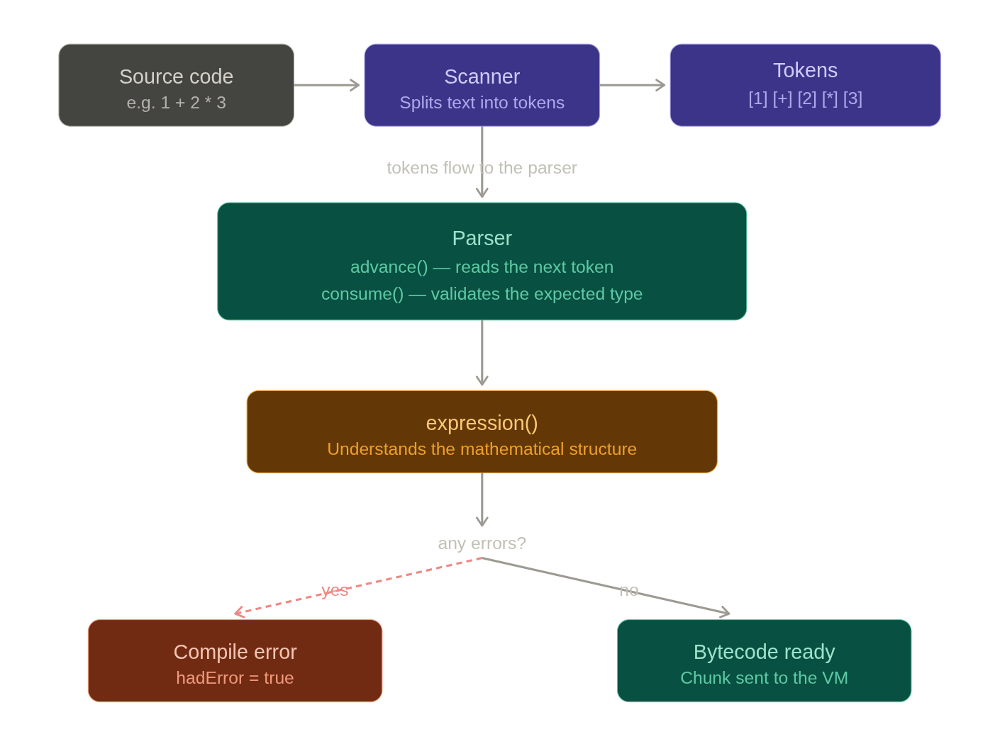

# My compiler — how it works so far

## What is this?

This is the beginning of a compiler written in C, following the book *Crafting Interpreters*. A compiler is a program that reads code you write (human-readable text) and turns it into instructions a machine can execute.

For now the compiler knows how to do one thing: **read a single expression** (like `1 + 2 * 3`) and lay the groundwork for turning it into bytecode instructions.

---

## How the code travels through the compiler
```
Source code  →  Scanner  →  Tokens  →  Parser  →  expression()  →  Bytecode / Error
```

### 1. The scanner splits the text into tokens

The compiler does not see `1 + 2` as a string of characters. First it breaks the text into meaningful pieces: the number `1`, the operator `+`, the number `2`. Each piece is called a *token*.

### 2. The parser reads tokens one by one

Two functions do this work:

- `advance()` — moves to the next token, like turning a page.
- `consume()` — moves forward but also checks that the token is the expected type. If it is not, it reports an error.

### 3. `expression()` understands the structure

This function (not fully implemented yet) will take the tokens and figure out what the expression means: what gets added, what has higher priority, and so on.

### 4. Error handling

The compiler tracks two internal flags:

- `hadError` — set to `true` if any error occurred during compilation.
- `panicMode` — activated on the first error to silence cascading errors afterwards, so the user sees one clear message instead of a flood.

If everything goes well, `compile()` returns `true` and the *chunk* (the block of bytecode instructions) is sent to the virtual machine. If something went wrong, it returns `false` and the chunk is discarded.

---

## Files so far

| File | What it does |
|---|---|
| `compiler.c` | The compiler: parses source code and prepares bytecode |
| `scanner/scanner.h` | The scanner: converts text into tokens |
| `compiler.h` | The public interface of the compiler |

---

## What is missing

- Implement `expression()` using Pratt's top-down operator precedence parsing algorithm
- Emit actual bytecode instructions into the chunk
- Support for statements (right now only single expressions are handled)

---

> Based on [*Crafting Interpreters*](https://craftinginterpreters.com/) by Robert Nystrom, chapter 17.

